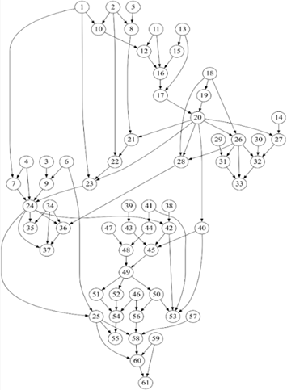

__L-DAG: A Breakthrough Deductive Reasoning Algorithm That Solves What GPT-4o, Claude 4, and Gemini 2.5 Pro Cannot__

This repository contains the paper with examples demonstrating that, unlike current LLMs which generate deductive reasoning solutions through Chain-of-Thought prompting and heuristic pattern-mapping in *solution path space*, the L-DAG algorithm operates entirely within the *constraint space*. It dynamically constructs solution paths by iterative reasoning about constraints.

It is a dynamic solution path construction process driven by two iterative interactive steps:
__Process i:__ reasoning about constraint search directions based on the currently active constraints, and
__Process ii:__ applying new constraints that further narrow the scope of Process i.

Each cycle uses simple logical operations (OR, AND, NOT) to progressively restrict the solution space. This process incrementally builds an explicit, structured deductive pathway with high efficiency.

__Examples__

*Figure 1. L-DAG workflow for Example 2.*

The combination of Figure 6a and Figure 6b in Section 3.2: 61 nodes and 89 deductive steps, with the longest reasoning chain spanning 17 steps. Despite this complexity, the problem is solvable through the sequential application of basic logical operations, as detailed in an introductory example in Section 2.3.

Two logical examples in the paper were tested on the leading AI systems. None of the tested systems produced a complete, correct solution using direct reasoning, Python, or MiniZinc. The last full testing on the following models was conducted on July 25, 2025. 

| __LLM (Version)__               | Example 2 - Reasoning | Example 2 - Python | Example 2 - MiniZinc | Example 3 (3 Solutions) - Reasoning  | Example 3 - Python | Example 3 - MiniZinc |
|---------------------------------|-----------------------|--------------------|----------------------|--------------------------------------|--------------------|----------------------|
| __Gemini Pro 2.5 (2025-06-05)__ | x                     | x                  | failed               | 1                                    | 1                  | 3                    |
| __ChatGPT 4o (2025-04-16)__     | x                     | x                  | failed               | 1                                    | 1                  | failed               |
| __DeepSeek r1 (2025-05-28)__    | x                     | x                  | x                    | 1                                    | 2                  | 44                   |
| __Claude Sonnet 4 (2025-05-22)__| x                     | x                  | x                    | x                                    | 1                  | 4                    |
| __Grok 3 (2025-02-17)__         | x                     | x                  | failed               | x                                    | x                  | 44                    |

*Note: "x" indicates an incorrect solution, and "failed" means the attempt could not compile or run after multiple tries.

*Example 1 is a complex logical proposition proof (6 variables, 10 premises, 64-row truth table).

__Features__
__Global Dependency Management:__ Maintaining and tracking logical dependencies and consistency across network-structured levels.

__Symbolic Logical Reasoning:__ Performing symbolic logical reasoning at each step using formal rules of inference to guarantee accuracy. Supports all forms of logical processes, including First-Order Logic (quantification over individuals), Second-Order Logic (quantification over sets, relations, or functions), and mathematical logic for proposition proving.

__Topological Order–Enforced Iterative Dynamic Construction:__ Arriving at a final solution iteratively through the searching and adding constraint nodes — constructing possibility nodes — eliminating invalid possibilities process.

__Searching Prioritization Strategies:__ Guiding the search for constraints and next seeds by prioritizing entities with high Win-Rate in the L-DAG.

__Conflict Resolution Support:__ Identifying and providing options for resolving conflicts, ambiguities, redundancies, and insufficient constraints.

__Timely Self-Reward Mechanism:__ Enhancing search and construction efficiency, and preventing combinatorial explosion by making function calls to calculate or estimate the possibility before processing a node. 

__Parallel Processing:__ Applying parallel processing in forward and backward (pruning of invalid branches) in both search and construction phases.

__Integrational Deductive Reasoning:__ Enabling scientific exploration through Entity Constraint Task and Entity Relation Task processes.

__License Notice__
This work is based on Independent Claim 4, disclosed in a pending U.S. patent application and its corresponding International Publication No. WO2025/117991 (publishing date 2025-06-05). An International Search Report, issued by the USPTO as the International Searching Authority, has confirmed this claim's novelty, inventive step, and industrial applicability. A copy of the International Search Report is available upon request.

__License for Claim 4__
Claim 4 is dually licensed. It is released under the Creative Commons Attribution 4.0 International License (CC-BY 4.0), and the author additionally grants a worldwide, royalty-free, irrevocable patent license for all uses, including commercial implementation.

__Coordinated Use of Other Claims__
Independent Claim 1 (a Personalized Heuristic Question-Answer Training process) and Independent Claim 5 (an Artificial General Intelligent Logical Twin System), along with all of their respective dependent claims, are reserved to ensure development is ethical, high-quality, and aligned with the author's vision. To that end, the author reserves the right to select development partners who best align with these criteria. Use of these claims requires a written agreement, which is granted without a licensing fee and shall mandate attribution, collaborative research, and a commitment to donate 1% of related revenues to support disadvantaged students. Interested parties are invited to contact the author and propose a development plan.